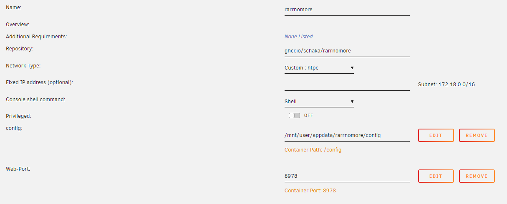
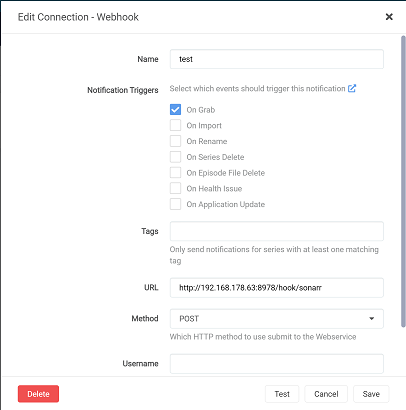

# Rarrnomore - prevent automatic grabs of rar'd scene releases

Disclaimer: I am not responsible for you deleting any torrents. Please test your setup before running it unmonitored.
**You need to set your torrent clients in Radarr and Sonarr to start new torrents in the paused state.**

### Notes
- currently, only qBittorrent and Transmission are supported

### Planned
- some unit tests
- (optional) other file types can be added to the exclusion list

This application works by monitoring Radarr and Sonarr `Grab` requests through web hooks that you need to set up. 
Once it receives a notification, it instantly connects to your torrent client, finds the torrent that was just added and checks its contents.
If it finds a .rar or partial rar (.r01) file, it sends a request to your servarr application to delete this item from the queue and blocklist that torrent.
If no rar is found, it sends a request to your torrent client to resume the torrent, starting the download.

## Setup
Currently, the code is only published as a docker image to GitHub.
If you cannot use Docker, you're out of luck for now.

### Setting up Docker
- map /config from within the container to a host folder of your choice
- within that host folder, put a copy of [application.yml](https://github.com/Schaka/rarrnomore/blob/main/src/main/resources/application.yml) from this repository
- choose either `QBITTORRENT` or `TRANSMISSION` (credentials not required for Transmission, if disabled)
- adjust said copy with your own info like *arr API keys and your preferred port
- forward the port you've chosen from your container to the host system

**Important**: The `clients.torrent.name` property needs to exactly match the name you gave your client in Sonarr/Radarr, this is validated against web hook requests at runtime.

A docker run command may look like this:
```
docker run
-d
--name='rarrnomore'
-e HOST_CONTAINERNAME="rarrnomore"
-p 8978:8978
-v '/mnt/user/appdata/rarrnomore/config':'/config':'rw' 'ghcr.io/schaka/rarrnomore'
```

### Setting up Unraid
- Go to Docker, click "Add Container" at the bottom
- enter image name 'schaka/rarrnomore'
- Click "Add another Path, Port, Variable, Label or Device", choose Path
- map Container Path `/config` to host path `/mnt/user/appdata/rarrnomore/config`
- map Container Port `8978` to host port `8978`

It should look like this:



### Configuring your web hook
- open Sonarr/Radarr, go to Settings => Connect
- click '+', choose Webhook, choose a name
- only enable Notification trigger 'Grab'
- enter `http://rarrnomore:8978/hook/sonarr`, where IP and port need to match your Docker container
- replace `sonarr` with `radarr` if applicable
- choose method POST, save the settings

It should look like this:


